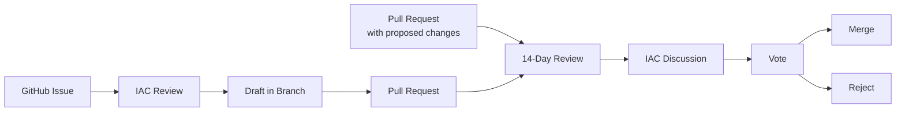

# CD-008 Review and Amendment Procedures

## Change History

| Version | Date | Description | Author |
|---------|------|-------------|--------|
| 1.0 | 2025-02-15 | Initial controlled document. Consolidates amendment process and voting rules. | Andrew Woodruff |
| 1.1 | 2025-02-17 | Restructured proposal process with two entry points (Issue or PR). Clarified 14-day review and IAC discussion requirements. Distinguished Controlled Document vs Primary Document approval outcomes. | Andrew Woodruff |
| 1.2 | 2026-02-17 | Elevated CD-005 Revenue Splits to require supermajority voting and Board approval. | Andrew Woodruff |

The key words "MUST", "MUST NOT", "SHOULD", "SHOULD NOT", and "MAY" in this document are to be interpreted as described in [RFC 2119](https://www.rfc-editor.org/rfc/rfc2119).

## 1. Overview
This document defines the procedures for proposing, reviewing, and approving changes to the OCME Governance Framework. It covers the amendment process for the Primary Document, Controlled Documents, and Colony Governance Extensions.

This document operationalizes the revision requirements established in Section 10 of the OCME Primary Document. For IAC structure and membership, see CD-006 Industry Advisory Council.

## 2. Change Authority
The following table defines which body has authority to approve changes at each document layer.

| Document Layer | Change Authority | Voting Requirement |
|---|---|---|
| OCME Charter | Board + State Filing | Board vote (per nonprofit law) |
| Primary Document (Sections 1-12) | OCME IAC + Board Approval | Supermajority (Section 4.2) |
| Universal Controlled Documents | OCME IAC | Standard Voting (Section 4.1) |
| CD-005 Revenue Splits | OCME IAC + Board Approval | Supermajority (Section 4.2) |
| Colony Governance Extensions | Colony IAC + OCME IAC compliance review | Per colony rules (Section 6) |
| Operational Documents (SOPs, workflows) | Executive Director | ED discretion |

Amendments to the OCME Charter are outside the scope of this document and are governed by applicable nonprofit law and Board action.

## 3. Proposal Process
Any ecosystem participant MAY propose a governance change. There are two entry points:

### 3.1 Governance Change Proposal Process
An ecosystem participant MAY submit a governance change proposal as a GitHub Issue in the Governance repository. This path is appropriate when the participant wants to propose a change but has not drafted the specific document edits. The issue MUST include:

- A clear description of the proposed change
- The rationale for the change
- Which document(s) would be affected

The IAC reviews the proposal for procedural validity. The IAC MAY deny proposals that are:

- Outside the scope of the Governance Framework
- Duplicates of existing proposals
- Procedurally invalid

The IAC MUST provide a written reason for any denial.

If the proposal is accepted for consideration, changes are drafted in a feature branch of the Governance repository. Drafts MUST follow existing document conventions and formatting. A Pull Request is then created linking back to the original issue.

Alternatively, an ecosystem participant MAY submit a Pull Request directly to the Governance repository with the proposed changes already drafted. This is the preferred path when the proposer is able to draft the specific document edits. The PR description MUST include:

- A clear description of the proposed change
- The rationale for the change

### 3.2 Community Review Period
Regardless of entry point, all Pull Requests proposing revisions to the Primary Document or Controlled Documents MUST remain open for a minimum of 14 days. During this period:

- The PR is open for comments from all ecosystem members
- The proposer SHOULD respond to substantive feedback
- The IAC MAY request revisions before proceeding to discussion

### 3.3 IAC Discussion
The proposal MUST be discussed at an IAC meeting before a vote can be held. The IAC SHOULD make a best faith effort to reach consensus before calling a vote.

### 3.4 Vote
If consensus cannot be reached, a formal vote is called per the voting rules in Section 4. The vote SHALL be held at the next meeting where quorum is met and at least 3 days' notice has been provided for the voting item.

### 3.5 Outcome
- **Approved (Controlled Documents):** The Pull Request is merged and the change takes effect per Section 5 (Effective Dates).
- **Approved (Primary Document or CD-005):** The Pull Request is held pending Board approval. Upon Board approval, the PR is merged and the change takes effect per Section 5 (Effective Dates).
- **Rejected:** The Pull Request is closed with a recorded rationale. The proposer MAY submit a revised proposal.

## 4. Voting Rules

### 4.1 Standard Voting
Standard voting applies to Controlled Documents, new IAC membership, and other matters not requiring supermajority approval.

- Prior to conducting a vote, the IAC SHOULD make a best faith effort to reach consensus.
- Only IAC members MAY vote.
- Votes SHALL occur in a meeting where quorum is met and at least 3 days' notice has been provided.
  - Quorum is a simple majority of members in attendance (51%).
- A simple majority vote is required to pass a measure.

### 4.2 Supermajority Voting

Supermajority voting applies to amendments to the Primary Document and to CD-005 Revenue Splits.

- Prior to conducting a vote, the IAC SHOULD make a best faith effort to reach consensus.
- Only IAC members MAY vote.
- Votes SHALL occur in a meeting where quorum is met and at least 3 days' notice has been provided.
  - Quorum is a supermajority of members in attendance (66.66%).
- A supermajority (66.66%) vote is required to pass a measure.
- Approved Primary Document amendments additionally MUST receive Board approval before taking effect.

### 4.3 Consensus
Consensus means an outcome that all can support, but it does not require unanimity. The IAC Chair determines when the IAC has reached consensus or is ultimately unable to reach a consensus decision.

### 4.4 IAC Chair Voting Responsibilities
The IAC Chair is responsible for:

- Announcing voting items with at least 3 days' notice
- Checking quorum before votes
- Administering votes and recording outcomes
- Recording the vote count and result in the meeting notes

## 5. Effective Dates
- Controlled Document amendments take effect upon PR merge following an approved vote.
- Primary Document and CD-005 amendments take effect upon PR merge following both IAC supermajority approval and Board approval.
- Colony Extension amendments take effect upon merge following Colony IAC approval and OCME IAC compliance confirmation.
- The Revision History table in each document MUST be updated to reflect the new version, date, and description of changes.

## 6. Colony Extension Amendments
Colony Governance Extensions are amended through their respective Colony IACs. The process is:

1. Proposal made to Colony IAC following the colony's established proposal process.
2. Discussion and consensus attempt within the Colony IAC.
3. Colony IAC vote per colony-specific rules. Colony IACs follow the same voting rules defined in Section 4 unless their Colony Governance Extension specifies otherwise with OCME IAC approval.
4. OCME IAC compliance review (see Section 6.1).

Colonies MAY only amend their colony-specific Controlled Documents and their Colony Governance Extension. Colonies MUST NOT amend universal governance.

### 6.1 OCME IAC Compliance Review
After a Colony IAC approves an amendment to its Colony Governance Extension, the OCME IAC conducts a compliance review to ensure:

- The amendment does not conflict with the OCME Primary Document.
- The amendment does not conflict with Universal Controlled Documents.
- The amendment maintains the colony's obligations under Section 11 of the Primary Document.

The OCME IAC MUST complete the compliance review within 30 days of notification. If no objection is raised within 30 days, the amendment is deemed compliant. If the OCME IAC identifies a compliance issue, it MUST notify the Colony IAC with a written explanation and the Colony IAC MUST revise or withdraw the amendment.

## 7. Annual Review
Per Section 10 of the Primary Document, the Governance Framework MUST be reviewed annually.

- The Executive Director SHALL be responsible for initiating the annual review.
- The annual review SHOULD assess whether the Primary Document, Controlled Documents, and Colony Extensions remain current and fit for purpose.
- The annual review SHOULD result in a written summary presented to the IAC, identifying any recommended amendments.
- The annual review does not require amendments — a finding of "no changes needed" is a valid outcome.

## 8. Emergency Amendments
In cases requiring urgent governance changes (e.g., legal compliance, security vulnerabilities, or situations that pose immediate risk to the ecosystem), the following expedited process applies:

- The Executive Director or any IAC member MAY invoke emergency procedures by notifying the IAC Chair.
- The community review period MAY be reduced to a minimum of 48 hours.
- A vote MAY be conducted via asynchronous written ballot (email or designated communication channel) rather than waiting for a scheduled meeting.
- All other voting thresholds and quorum requirements SHALL remain unchanged.
- Emergency amendments MUST be ratified at the next regularly scheduled IAC meeting. If not ratified, the amendment is reversed.
- The use of emergency procedures MUST be documented in the meeting notes with the justification for urgency.
